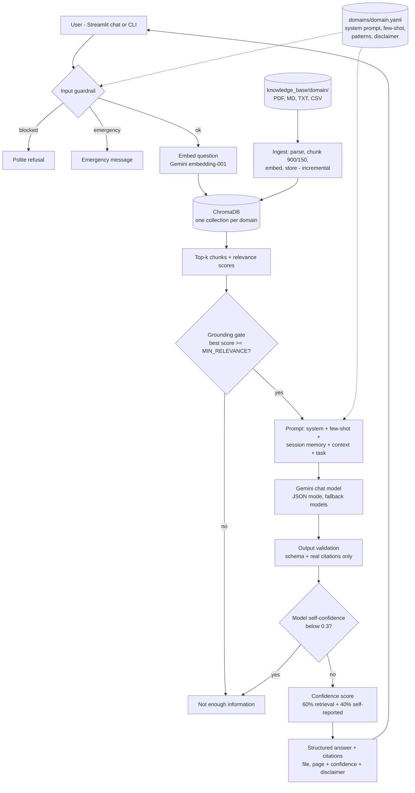
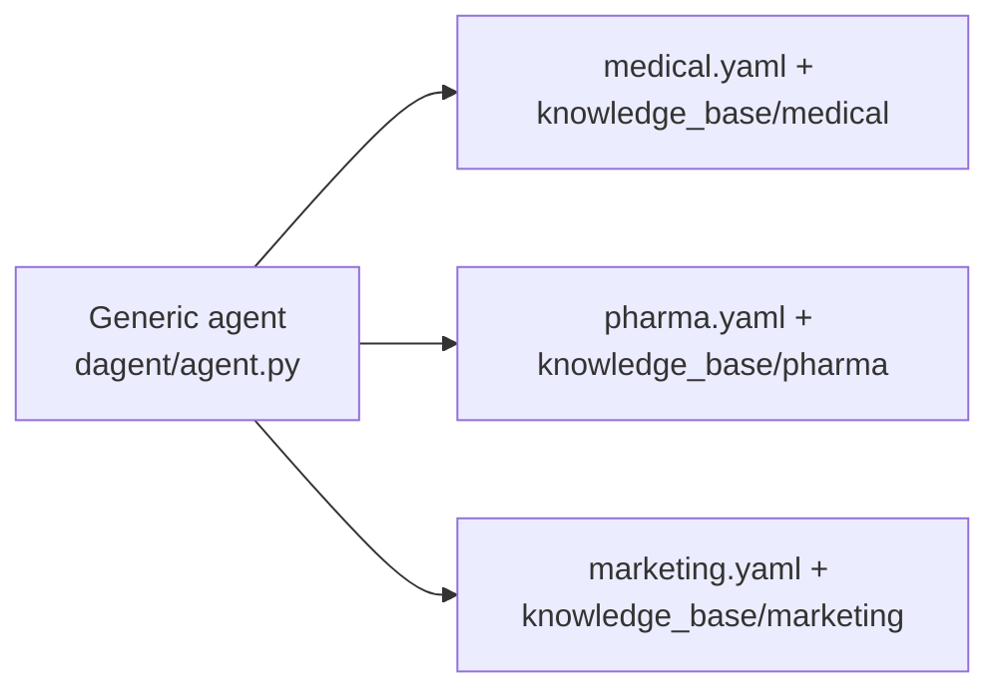
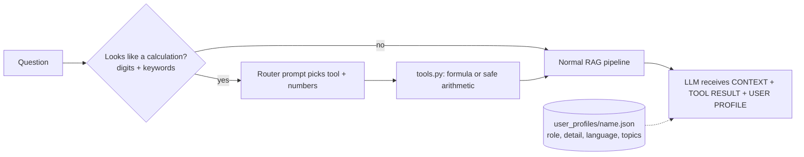

# Architecture

## End-to-end flow


## Same agent, three domains

Switching domain changes only: system prompt, few-shot examples, task list, blocked/emergency patterns, disclaimer, and which vector collection is searched.

## Components
| Component | Choice | Role |
|---|---|---|
| LLM | Gemini (`gemini-flash-lite-latest`, automatic fallbacks) | Reasoning, structured JSON answer |
| Embeddings | `gemini-embedding-001`, 768 dims | Semantic search |
| Vector DB | ChromaDB (cosine, persistent, one collection per domain) | Retrieval |
| Parsing / chunking | pypdf, csv, `RecursiveCharacterTextSplitter` (900 chars, 150 overlap) | Page-aware chunks |
| Orchestration | LangChain core, text-splitters, chroma | Messages, splitting, vector store |
| Config | YAML per domain, `.env` for keys and thresholds | Domain adaptation |
| UI | Streamlit | Chat, domain/task switcher, sources |

## Structured output
```json
{"summary": "...", "key_points": [], "recommendations": [], "risks_or_cautions": [],
 "sources_used": ["file.pdf"], "self_confidence": 0.0}
```
The agent adds `citations` (for example `file.pdf (page 12)`) built from the chunks actually retrieved, plus `confidence {label, score}` and the domain disclaimer.

## Bonus: calculator tool and personalization inside the pipeline

If retrieval finds nothing relevant but the calculator succeeded, the exact calculation is still returned (citation: Built-in calculator).
